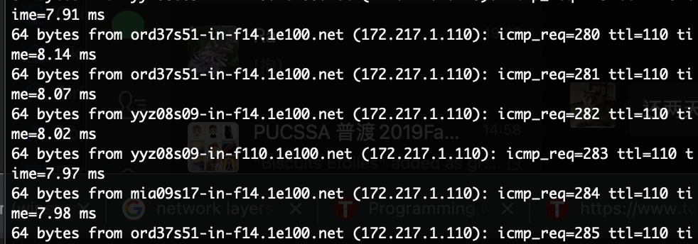
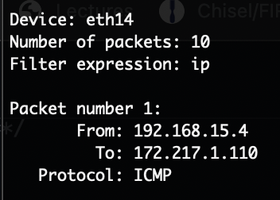
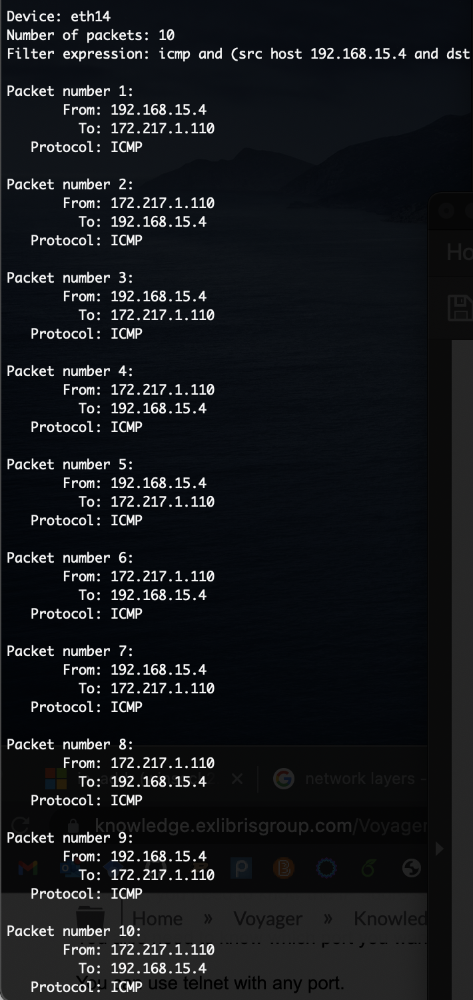
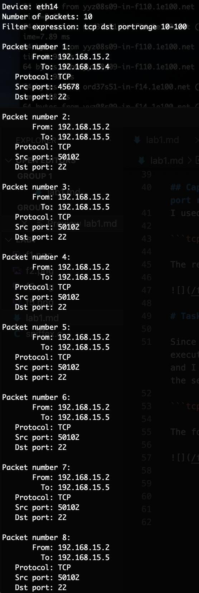
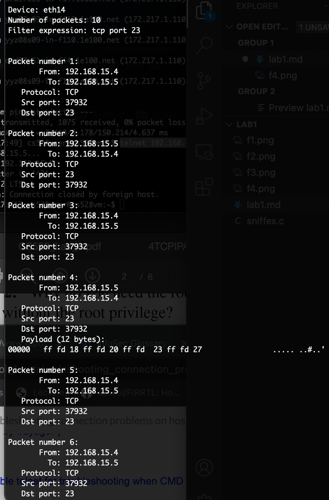
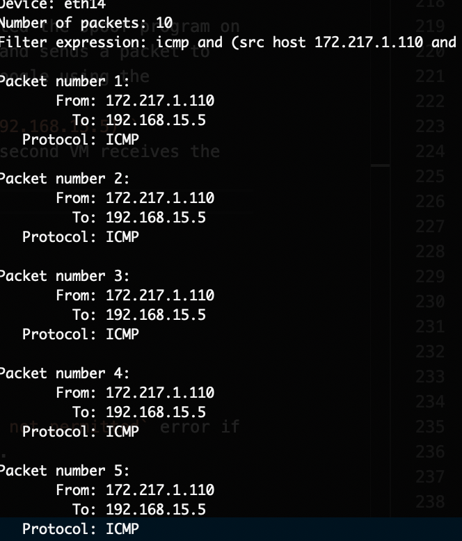
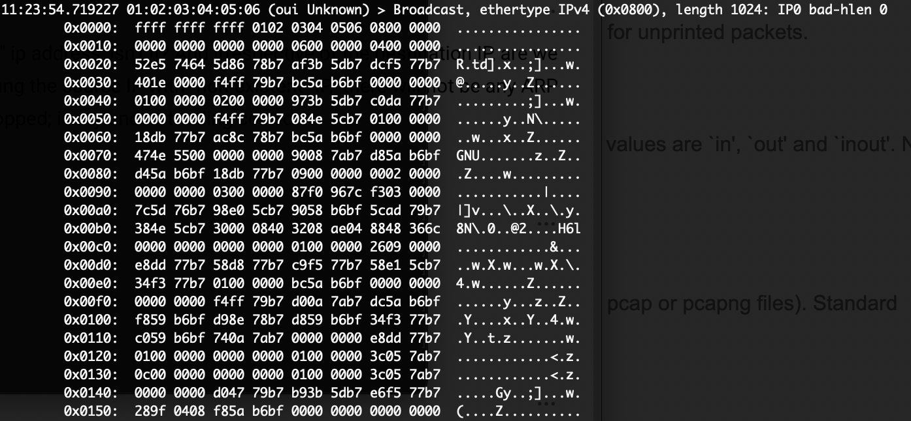

# CS 528 Lab 1 Report
Luke Jiang (jiang700@purdue.com)

# Task 1.a
## Problem 1
* `pcap_lookupdev`: find the default device to capture.
* `pcap_lookupnet`: given a network device, return its IPv4 address and the mask used for the device.
* `pcap_open_live`: create a sniffing session for a device. User can specify the maximum number of bits to be captured, to use promiscuous mode or not, and a timeout. The return value is a session handle.
* `pcap_datalink`: determine the type of link-later headers for the given handle. 
* `pcap_compile`: given a session handle and a source pcap-filter program as a string, compile the program and store the compilation output.
* `pcap_setfilter`: apply a compiled filter to a sniffing session.
* `pcap_loop`: the actual sniffing. Given a session handle, a integer specifying how many packets to sniff, and a callback function, invoke the callback function everytime a packet is sniffed.
* `pcap_freecode`: release memory allocated for a compiled pcap-filter program.
* `pcap_close`: close a session handle.

## Problem 2
`sniffex` requires access to a network device in order to open a session on it. If it is not executed with the root privilege, line `529` (call to `pcap_lookupdev`) or line `538` (call to `pcap_lookupnet`) in `sniffex.c` would fail, depending on if the user provides an argument to the sniffex or not.


## Problem 3
The promiscuous mode sniffs all traffics on wire, while the non-promiscuous mode only sniffs traffics that are directly related to it. One can set the third parameter of the call to `pcap_open_live` at line `551` to `0` to turn off promiscuous mode and to `1` to turn it on.
To demonstrate the difference between the two modes, I first started the first VM with IP address `192.168.15.4` and executed command `ping www.google.com` to create traffic to `172.217.1.110`:



I then started the second VM and with IP address `192.168.15.5` and executed `sniffex` in the promiscuous mode. The traffic from my first VM is sniffed:



After I turn off the promiscuous mode, the traffic is gone, leaving only packets associated only with the second VM.

# Task 1.b
## Capture the ICMP packets between two specific hosts
I used the following filter program to capture traffic between the first VM `192.168.15.4` and www.google.com `172.217.1.110`:

```icmp and (src host 192.168.15.4 and dst host 172.217.1.110) or (src host 172.217.1.110 and dst host 192.168.15.4)```

With promiscuous mode on, the second VM sniffs only the filtered traffic:



## Capture the TCP packets that have a destination port range from to port 50 - 100.
I used the following filter program:

```tcp dst portrange 10-100```

The results are the following:



# Task 1.c

Since `telnet` uses TCP protocol on port `23`, I executed `telnet 192.168.15.5 23` on the first VM and I used the following program for `sniffex` on the second VM:

```tcp port 23```

The following screenshot shows the result:



# Task 2.b
The implementation is available in file `spoof-echo.c`.

To test the validity of my implementation, I executed `spoof-echo.c` on the first VM, which pretends to be www.google.com and sends a packet to the second VM. The second VM sniffs packets from Google using the following filter:
```icmp and (src host 172.217.1.110 and dst host 192.168.15.5)```
Every time spoof is executed on the first VM, the second VM receives the packet:



# Task 2.c
The implementation is available in file `spoof-frame.c`.

To test the validity of my implementation, I executed `spoof-frame.c` on the first VM, which broadcasts the Ethernet frame with spoofed source MAC address. I then executed `sudo tcpdump -vv -e -XX not port 22` on the second VM and received the frame:




# Task 2 Questions

## Question 4
No. If the IP packet length is smaller than the size of the IP header (`20`), `sendto` will return an `Invalid argument` error.

## Question 5
No. Linux provides checksum offload, which means that users can leave the checksum field ad `0x0` and the kernel will automatically fill the field with the correct checksum.

## Question 6
Linux kernel only allows processes with an user ID of `0` to open raw sockets. The `socket` system call will return an `Operation not permitted` error if the program is not executed in the root priviledge.

## Question 7
* `socket`: create a socket descriptor for a given protocol.
* `sendto`: send out a packet.
* `ioctl`: get the interface index for Ethernet device.

# Task 3 Questions

